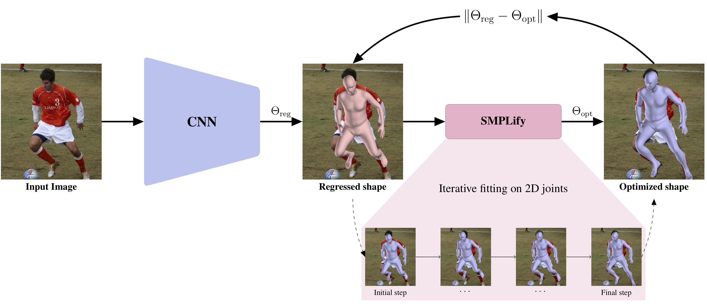

# SPIN - SMPL oPtimization IN the loop
Code repository for the paper:  
**Learning to Reconstruct 3D Human Pose and Shape via Model-fitting in the Loop**  
[Nikos Kolotouros](https://www.nikoskolot.com/)\*, [Georgios Pavlakos](https://geopavlakos.github.io/)\*, [Michael J. Black](https://ps.is.mpg.de/~black), [Kostas Daniilidis](http://www.cis.upenn.edu/~kostas/)  
ICCV 2019  
[[paper](https://arxiv.org/pdf/1909.12828.pdf)] [[project page](https://www.nikoskolot.com/projects/spin/)]




## Installation instructions
Start locally:
```
git clone https://github.com/dqj5182/SPIN.git
cd SPIN
```

Create conda environment and install PyTorch and other packages:
```
# Initialze conda env
conda create -n spin python=3.9
conda activate spin

# Install PyTorch and other packages
conda install pytorch==1.10.1 torchvision==0.11.2 torchaudio==0.10.1 cudatoolkit=10.2 -c pytorch
pip install -r requirements.txt
```

* If you encounter error like "RuntimeError: The detected CUDA version (11.6) mismatches the version that was used to compile PyTorch (10.2). Please make sure to use the same CUDA versions.":
```
export PATH=/usr/local/cuda-10.2/bin:/usr/local/cuda-10.2/NsightCompute-2019.1${PATH:+:${PATH}}
export LD_LIBRARY_PATH=/usr/local/cuda-10.2/lib64\ ${LD_LIBRARY_PATH:+:${LD_LIBRARY_PATH}}
```
or refer to [reference](https://stackoverflow.com/questions/53422407/different-cuda-versions-shown-by-nvcc-and-nvidia-smi).

## Download data
This provides necessary data for training and evaluation. Please run:
```
./fetch_data.sh
```

Please also download SMPL human model files from [Google Drive](https://drive.google.com/drive/folders/1A7c0LsiHo4vznIajx3lCfLGEKHEXDEcD?usp=sharing) and move the files under `data`. </br>
Note that these files under license.

## Data
You need to follow directory structure of the `data` as below.
```
${ROOT} 
|-- data  
|   |-- dataset_extras
|   |   |--3dpw_test.npz
|   |   |--coco_2014_train.npz
|   |   |--h36m_valid_protocol1.npz
|   |   |--h36m_valid_protocol2.npz
|   |   |--hr-lspet_train.npz
|   |   |--lsp_dataset_original_train.npz
|   |   |--lsp_dataset_test.npz
|   |   |--mpi_inf_3dhp_train.npz
|   |   |--mpi_inf_3dhp_valid.npy
|   |   |--mpii_train.npz
|   |-- static_fits
|   |   |--coco_fits.npy
|   |   |--lsp-orig_fits.npy
|   |   |--lspet_fits.npy
|   |   |--mpi-inf-3dhp_fits.npy
|   |   |--mpi-inf-3dhp_mview_fits.npz
|   |   |--mpii_fits.npy
|   |-- cube_parts.npy
|   |-- gmm_08.pkl
|   |-- J_regressor_extra.npy
|   |-- J_regressor_h36m.npy
|   |-- model_checkpoint.pt
|   |-- README.md
|   |-- SMPL_FEMALE.pkl
|   |-- SMPL_MALE.pkl
|   |-- smpl_mean_params.npz
|   |-- SMPL_NEUTRAL.pkl
|   |-- train.h5
|   |-- vertex_texture.npy
```


## Final fits
We also release the improved fits that our method produced at the end of SPIN training. You can download them from [here](http://visiondata.cis.upenn.edu/spin/spin_fits.tar.gz). Each .npz file contains the pose and shape parameters of the SMPL model for the training examples, following the order of the training .npz files. For each example, a flag is also included, indicating whether the quality of the fit is acceptable for training (following an automatic heuristic based on the joints reprojection error).

## Run demo code
To run our method, you need a bounding box around the person. The person needs to be centered inside the bounding box and the bounding box should be relatively tight. You can either supply the bounding box directly or provide an [OpenPose](https://github.com/CMU-Perceptual-Computing-Lab/openpose) detection file. In the latter case we infer the bounding box from the detections.

In summary, we provide 3 different ways to use our demo code and models:
1. Provide only an input image (using ```--img```), in which case it is assumed that it is already cropped with the person centered in the image.
2. Provide an input image as before, together with the OpenPose detection .json (using ```--openpose```). Our code will use the detections to compute the bounding box and crop the image.
3. Provide an image and a bounding box (using ```--bbox```). The expected format for the json file can be seen in ```examples/im1010_bbox.json```.

Example with OpenPose detection .json
```
python3 demo.py --checkpoint=data/model_checkpoint.pt --img=examples/im1010.jpg --openpose=examples/im1010_openpose.json
```
Example with predefined Bounding Box
```
python3 demo.py --checkpoint=data/model_checkpoint.pt --img=examples/im1010.jpg --bbox=examples/im1010_bbox.json
```
Example with cropped and centered image
```
python3 demo.py --checkpoint=data/model_checkpoint.pt --img=examples/im1010.jpg
```

Running the previous command will save the results in ```examples/im1010_{shape,shape_side}.png```. The file  ```im1010_shape.png``` shows the overlayed reconstruction of the model on the image.  We also render a side view, saved in ```im1010_shape_side.png```.

## Run evaluation code
Besides the demo code, we also provide code to evaluate our models on the datasets we employ for our empirical evaluation. Before continuing, please make sure that you follow the [details for data preprocessing](datasets/preprocess/README.md).

Example usage:
```
python3 eval.py --checkpoint=data/model_checkpoint.pt --dataset=h36m-p1 --log_freq=20
```
Running the above command will compute the MPJPE and Reconstruction Error on the Human3.6M dataset (Protocol I). The ```--dataset``` option can take different values based on the type of evaluation you want to perform:
1. Human3.6M Protocol 1 ```--dataset=h36m-p1```
2. Human3.6M Protocol 2 ```--dataset=h36m-p2```
3. 3DPW ```--dataset=3dpw```
4. LSP ```--dataset=lsp```
5. MPI-INF-3DHP ```--dataset=mpi-inf-3dhp```

You can also save the results (predicted SMPL parameters, camera and 3D pose) in a .npz file using ```--result=out.npz```.

For the MPI-INF-3DHP dataset specifically, we include evaluation code only for MPJPE (before and after alignment). If
you want to evaluate on all metrics reported in the paper you should use the official MATLAB test code provided with the
dataset together with the saved detections.

## Run training code
Due to license limitiations, we cannot provide the SMPL parameters for Human3.6M (recovered using [MoSh](http://mosh.is.tue.mpg.de)). Even if you do not have access to these parameters, you can still use our training code using data from the other datasets. Again, make sure that you follow the [details for data preprocessing](datasets/preprocess/README.md).

Example usage:
```
python3 train.py --name train_example --pretrained_checkpoint=data/model_checkpoint.pt --run_smplify
```
You can view the full list of command line options by running `python3 train.py --help`. The default values are the ones used to train the models in the paper.
Running the above command will start the training process. It will also create the folders `logs` and `logs/train_example` that are used to save model checkpoints and Tensorboard logs.
If you start a Tensborboard instance pointing at the directory `logs` you should be able to look at the logs stored during training.

## Citing
If you find this code useful for your research or the use data generated by our method, please consider citing the following paper:

	@Inproceedings{kolotouros2019spin,
	  Title          = {Learning to Reconstruct 3D Human Pose and Shape via Model-fitting in the Loop},
	  Author         = {Kolotouros, Nikos and Pavlakos, Georgios and Black, Michael J and Daniilidis, Kostas},
	  Booktitle      = {ICCV},
	  Year           = {2019}
	}
